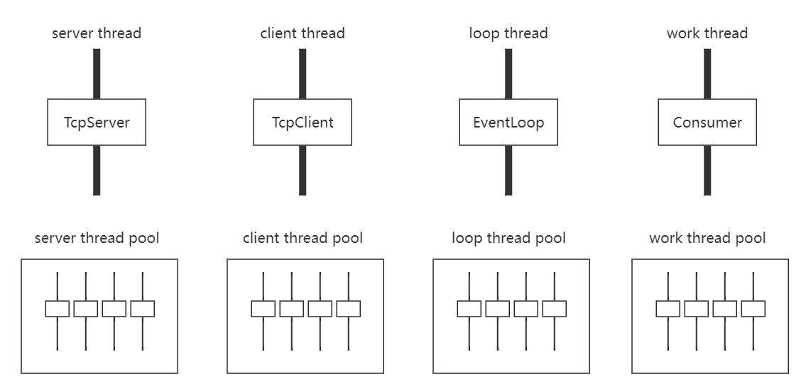
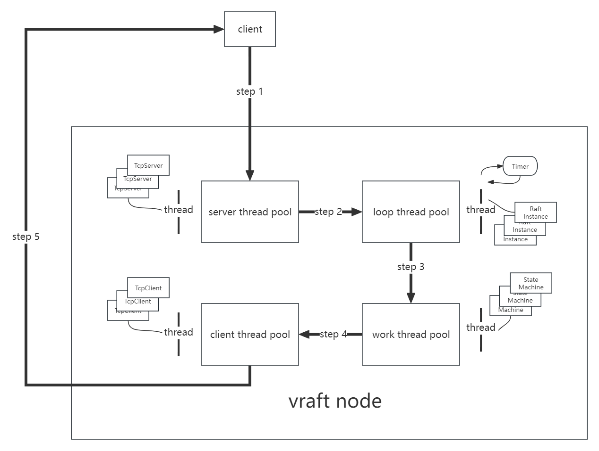
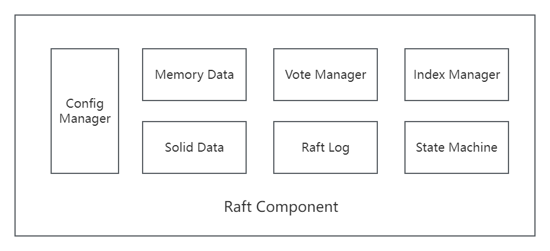
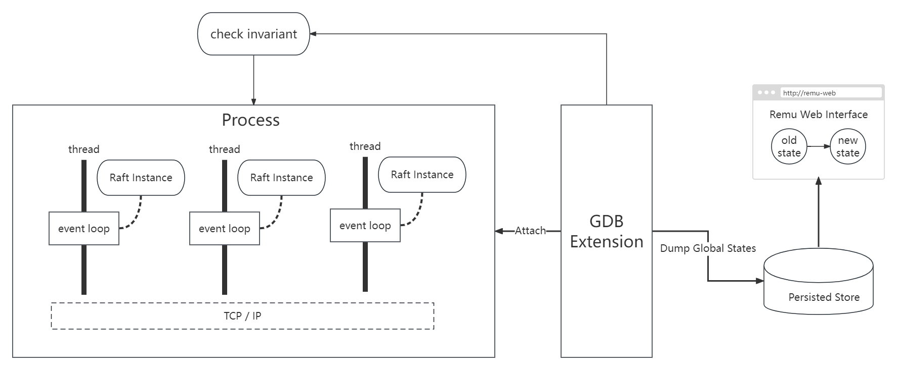
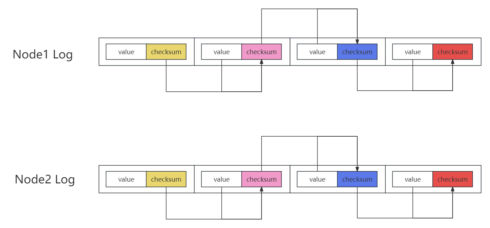
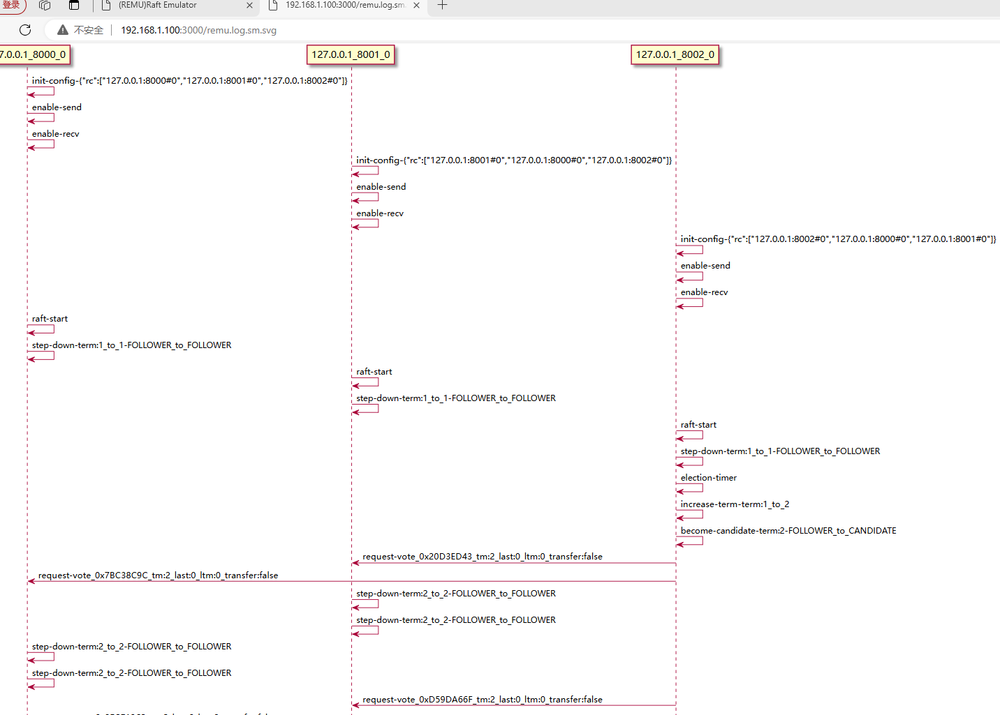
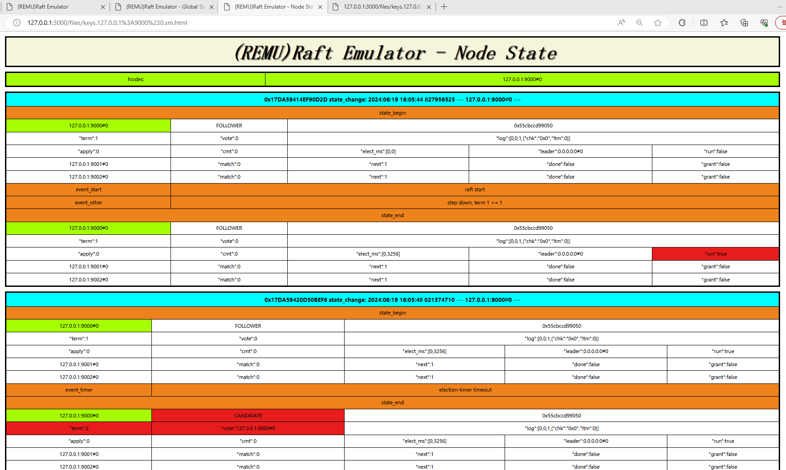
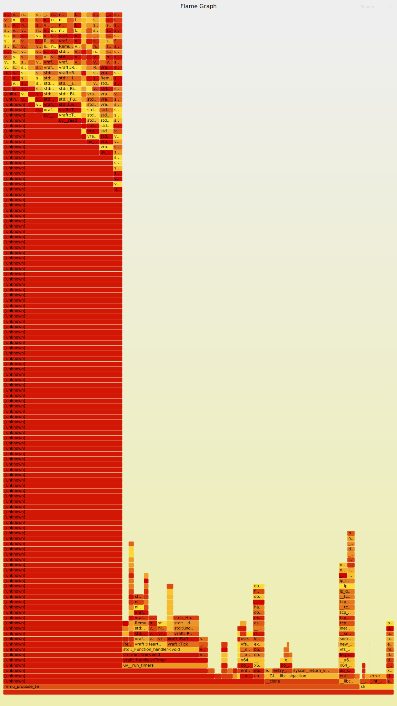

# 0 - Introduction | [中文](https://github.com/vectordb-io/vraft/blob/main/README_CN.md)

VRAFT is a framework written in C++ that implements the RAFT protocol and the SEDA architecture. Based on VRAFT, distributed software can be developed easily, such as distributed storage system and [vectordb]((https://github.com/vectordb-io/vectordb)).

* **Program with TLA+ Specification** -- Coding with the assistance of [TLA+ Specification](https://lamport.azurewebsites.net/tla/tla.html) to theoretically ensure the correctness of the system.
* **Remu([Raft Emulator](https://zhuanlan.zhihu.com/p/707899225))** -- There's a Built-in raft emulator that allows for distributed debugging, distributed global state viewing, and distributed automated testing.
* **Debug Everything** -- The full-stack source code of VRAFT can be debugged.
* **Infrastructure Software Demo** -- There are several demos of infrastructure software in VRAFT, such as distributed KV-store, metadata management center, distributed SQL, vectordb ...

#### Features:
* Basic Raft
* Raft Cluster Emulator
  * Global State Change View
  * Auto Message Flow
  * Cluster Breakpoint Debugger
* Multi-Raft
* Pre-Vote
* Leadership Transfer
* Dynamic Membership Change
* Execution History CheckSum

#### Articles:
* [《自己动手实现Raft》](https://zhuanlan.zhihu.com/p/706518239)  
* [《Raft Emulator的设计》](https://zhuanlan.zhihu.com/p/707899225)  
* [《理解状态机》](https://zhuanlan.zhihu.com/p/707074454)  
* [《聊聊TLA+》](https://zhuanlan.zhihu.com/p/707837593)  

#### Video:
* [《自己动手实现Raft》](https://www.bilibili.com/video/BV1wKhkeZEv8/?spm_id_from=333.999.0.0&vd_source=667dd64b8a907b2bb227ba72255947be)  

# 1 - Architecture
## SEDA (Staged Event-Driven Architecture)
* SEDA is a highly scalable internet software architecture, and VRAFT implements SEDA to support Multi-Raft.
* [SEDA Paper](https://courses.cs.vt.edu/cs5204/fall09-kafura/Papers/Threads/SEDA-Events.pdf)

## VRaft-SEDA-Implementation
* Four types of threads:
  * Server Thread: Implements TcpServer to receive messages from network.
  * Client Thread: Implements TcpClient to send messages to network.
  * Loop Thread: Implements EventLoop, used to respond to events (Raft messages, timer events, etc...)
  * Work Thread: Implements producer-consumer model to process messages sequentially.
* Each type of thread has a corresponding thread pool, and the number of threads in the pool is configured based on the actual hardware conditions.

* Each Raft instance has a unique 64-bit RaftId, and this RaftId is included in Raft messages.
* Raft messages are passed between thread pools to complete the full Raft protocol process.
* Messages with the same RaftId are always processed by the same thread.
* A single thread can serve multiple different Raft instances.

## VRaft Inner Component

# 2 - REMU (Raft Emulator)

[《Raft Emulator的设计》](https://zhuanlan.zhihu.com/p/707899225)  

## Remu-Architecture

## History Checksum

## Web Insight

#### auto generate message flow

#### global state change

#### node state change

# 3 Flame Graph
* to be optimized ...

