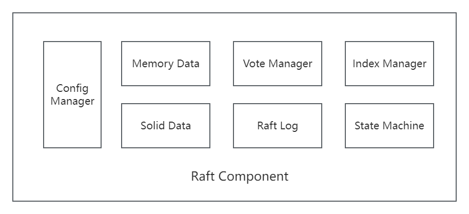
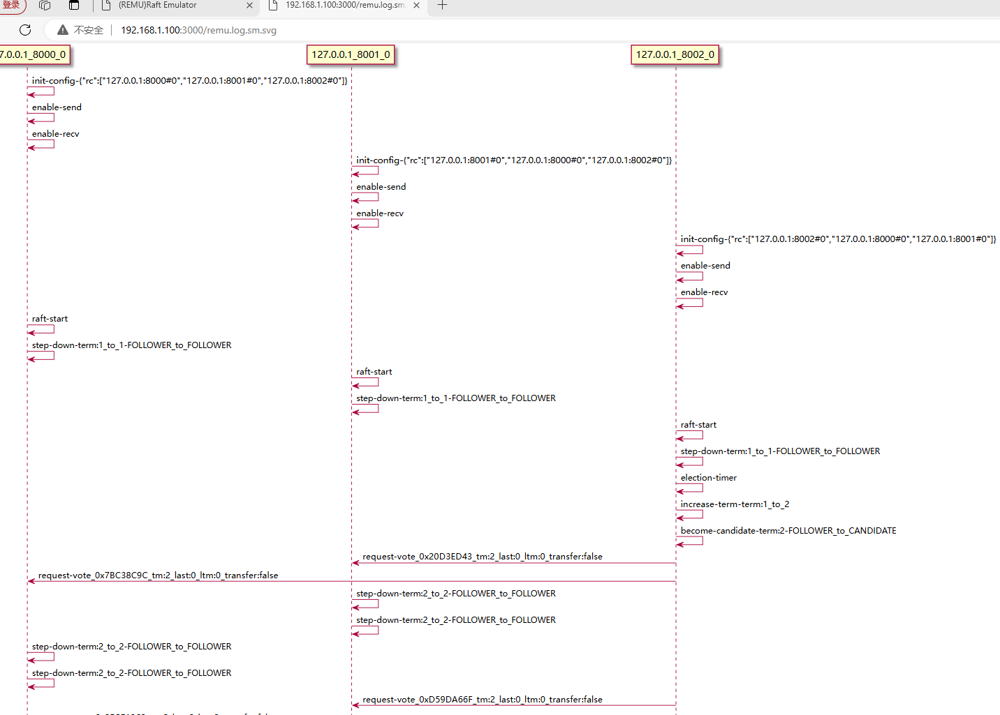

# 0 - Introduction | [English](https://github.com/vectordb-io/vraft/blob/main/README.md)

VRAFT是一个用C++编写的分布式开发框架, 实现了RAFT协议和SEDA架构, 可以基于VRAFT来开发各种分布式软件, 如分布式存储系统, [向量数据库](https://github.com/vectordb-io/vectordb)等.

#### VRAFT有如下特点:
* **Program with TLA+ Specification** -- 采用[TLA+](https://lamport.azurewebsites.net/tla/tla.html)形式化验证语言进行辅助编码, 从理论上保证系统的正确性.
* **Remu([Raft Emulator](https://zhuanlan.zhihu.com/p/707899225))** -- 内置一个Raft模拟器, 可以进行分布式调试, 分布式全局状态查看, 分布式自动化测试. 
* **Debug Everything** -- 全栈源代码可调试.
* **Infrastructure Software Demo** -- 内置若干基础架构软件的实现Demo(分布式kv-store, 分布式元数据管理, 分布式SQL, 向量数据库 ...)

#### 功能点:
* Basic Raft
* Raft Cluster Emulator
  * Global State Change View
  * Auto Message Flow
  * Cluster Breakpoint Debugger
* Multi-Raft
* Pre-Vote
* Leadership Transfer
* Dynamic Membership Change
* Execution History CheckSum

#### 参考文章:
* [《自己动手实现Raft》](https://zhuanlan.zhihu.com/p/706518239)  
* [《Raft Emulator的设计》](https://zhuanlan.zhihu.com/p/707899225)  
* [《理解状态机》](https://zhuanlan.zhihu.com/p/707074454)  
* [《聊聊TLA+》](https://zhuanlan.zhihu.com/p/707837593)  

#### 参考视频:
* [《自己动手实现Raft》](https://www.bilibili.com/video/BV1wKhkeZEv8/?spm_id_from=333.999.0.0&vd_source=667dd64b8a907b2bb227ba72255947be)  

# 1 - Architecture
## SEDA (Staged Event-Driven Architecture)
* SEDA 是一种扩展性很强的互联网软件架构, VRAFT实现了SEDA, 用来支持Multi-Raft.
* [SEDA架构的论文](https://courses.cs.vt.edu/cs5204/fall09-kafura/Papers/Threads/SEDA-Events.pdf)

## VRaft-SEDA-Implementation
* VRAFT中有4种不同功能的线程:
  * Server Thread: 实现TcpServer, 用来接收网络消息.
  * Client Thread: 实现TcpClient, 用来发送网络消息.
  * Loop Thread: 实现EventLoop, 用来对各种事件(Raft消息, 定时器事件等)进行响应.
  * Work Thread: 实现生产者消费者模型, 用来顺序处理消息.
* 每种线程都有对应的线程池, 线程池中线程的个数根据实际硬件情况进行配置.

* 每个Raft Instance拥有唯一的64位RaftId, Raft消息中包含这个RaftId.
* Raft消息在线程池之间传递, 完成完整的Raft协议流程.
* 相同RaftId的消息永远被相同的线程处理.
* 一个线程可以服务多个不同的Raft Instance.

## VRaft Inner Component

# 2 - REMU (Raft Emulator)

[《Raft Emulator的设计》](https://zhuanlan.zhihu.com/p/707899225)  

## Remu-Architecture

## Web Interface

#### 自动Raft生成消息流程图

#### 全局状态转换

#### 单节点状态转换

# 3 Flame Graph
* 持续优化

